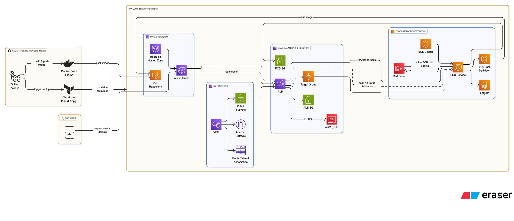
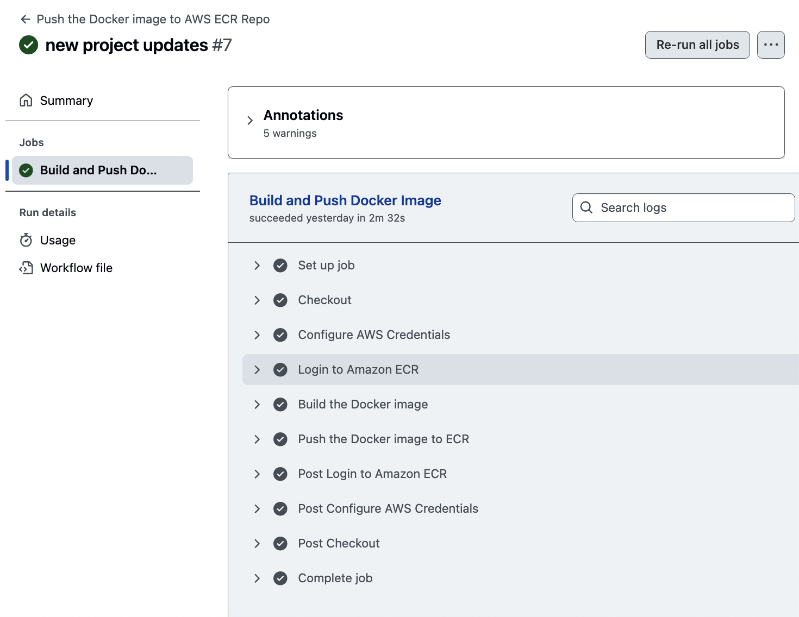
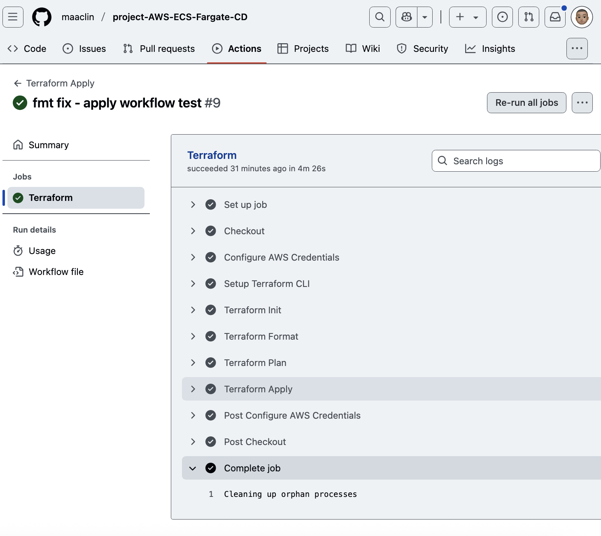
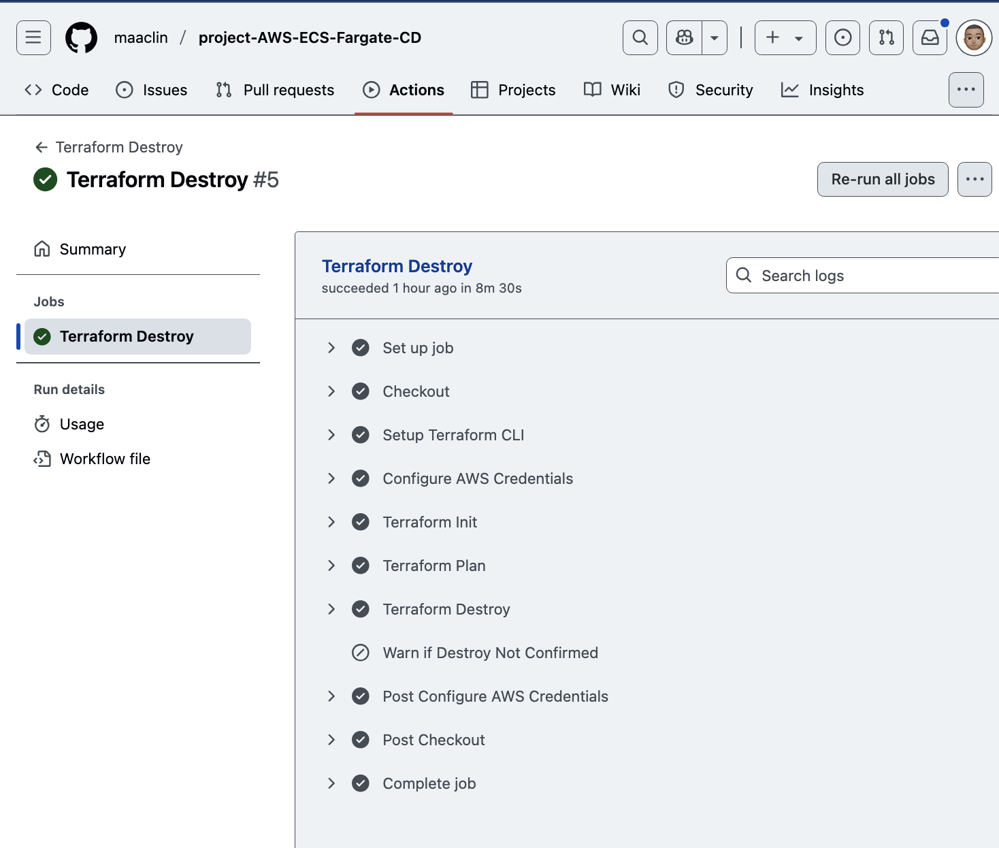
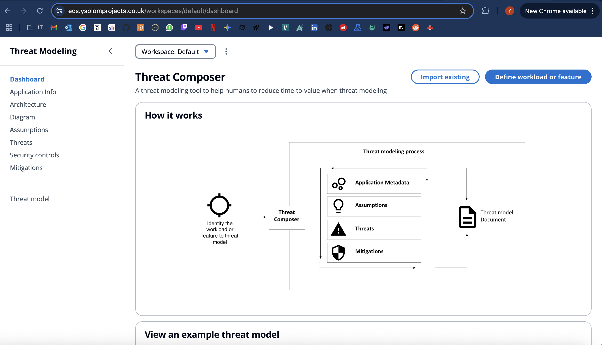

# AWS Threat Composer App - Deployment with ECS, Fargate, Terraform and GitHub Actions 

--- 

## Introduction

This project demonstrates the deploying a containerised web application to AWS. I've used Docker for efficient application packaging, GitHub Actions for automated image building and pushing to ECR and Terraform for defining and managing all necessary AWS infrastructure including - ECS, Fargate, ALB and Route53. The goal is to create a highly available web service accessible via my custom domain.



--- 

### Directory Structure 

```
/
├── .github/
│   └── workflows/
│       ├── docker-build.yml
│       ├── terraform-plan.yml
│       ├── terraform-apply.yml
│       └── terraform-destroy.yml
├── app/
├── images/
├── terraform/
│   ├── modules/
│   │   ├── alb/
│   │   │   ├── main.tf
│   │   │   ├── outputs.tf
│   │   │   └── variables.tf
│   │   ├── iam/
│   │   │   ├── main.tf
│   │   │   ├── outputs.tf
│   │   │   └── variables.tf
│   │   ├── ecs/
│   │   │   ├── main.tf
│   │   │   ├── outputs.tf
│   │   │   └── variables.tf
│   │   ├── dns/
│   │   │   ├── main.tf
│   │   │   ├── outputs.tf
│   │   │   └── variables.tf
│   │   ├── vpc/
│   │   │  ├── main.tf
│   │   │  ├── outputs.tf
│   │   │  └── variables.tf
│   │   └── acm/
│   │       ├── main.tf
│   │       ├── outputs.tf
│   │       └── variables.tf
│   ├── main.tf
│   ├── outputs.tf
│   ├── providers.tf
│   ├── terraform.tfvars
│   └── variables.tf
├── .gitignore
└── README.md
```
---

### Deployment Workflow 

1. Docker Build

- New changes are pushed to Github
- Workflow builds the image
- Pushes the image to Amazon ECR
- Latest image deployed by ECS 



2. Terraform Plan + Apply 

- New changes are pushed to Github
- Performs an init, plan and apply
- Creates all resources needed for application 




3. Terraform Destroy

- Destroys all resources when triggered using a workflow trigger on Github Actions and "yes" is explicitly passed



--- 

### Final Product - ecs.ysolomprojects.co.uk



---

### Considerations

- .dockerignore: Files like node_modules and other non-essential files are excluded to keep the Docker image small and build times fast.

- .gitignore: The .terraform directory which contains Terraform's state files and plugins is included in .gitignore to prevent it from being committed to source control, ensuring a clean repository and avoiding potential conflicts with team members.

- I chose ECS because it offered integration with our AWS-based infrastructure, a simpler and cheaper setup than Kubernetes. It allowed us to focus on development rather than managing complex cluster configurations, which was the core focus of this project. For a larger project, I would possibly look into using Kubernetes due to the customisation options at your disposal. 

--- 

### Architecture & Components

The deployment architecture is built upon several key AWS services and components:

#### 1. Docker Image Build

The frontend is packaged using a multi-stage Dockerfile. The app is first built with Node.js and then served using Nginx. This keeps the image small and fast to deploy.


#### 2. AWS Infrastructure (Terraform)

All AWS resources are provisioned using Terraform, ensuring IAC and DRY principles are followed. Resources were initially defined in a single main.tf for clarity and then organized into modules for better maintainability and reusability. The setup includes:

- A VPC with public subnets and an internet gateway.

- An Application Load Balancer (ALB) to handle traffic.

- Security groups to control access.

- DNS records managed via Route 53 (domain must be set up manually before the first run).

- An SSL certificate from AWS Certificate Manager to enable HTTPS.


#### 3. Container Orchestration (ECS on Fargate)

ECS Cluster: A logical grouping of tasks or services.

The app runs on AWS Fargate, which means there's no need to manage servers. The ECS service ensures the container stays running and handles deployments. Task definitions specify how the container runs and IAM roles give the service access to other AWS features like logging and image retrieval from ECR.


#### 4. Domain Name System (Route 53)

Route 53 is used to point a subdomain (ecs.ysolomprojects.com) to the load balancer, so users can access the site via URL instead of our load balancer url. A verified SSL certificate from ACM ensures the connection is secure.


### Automation with GitHub Actions

Now, to the backbone of DevOps... CI/CD.

#### Continuous Integration (CI) - Docker Image:

Trigger: On changes to the main branch (or specific Dockerfile/application code paths).

Steps:

```
- Checkout code.
- Login to AWS ECR.
- Build Docker image using the Dockerfile.
- Tag the Docker image (e.g., with Git commit SHA or version).
- Push the tagged image to the ECR repository.
```

#### Continuous Integration (CI) - Terraform Plan:

Trigger: On changes to the main branch 

Steps:

```
- Checkout code.
- Performs terraform init, fmt and validate
- Performs tflint to ensure files are valid
- Performs a checkov scan checking for admin privileges, hardcoded keys and ALB listener set to HTTPS 

```

#### Continuous Delivery (CD) - Terraform Deployment:

Trigger: This will begin n changes to the main branch for our terraform apply workflow and use a manual trigger to ensure accidental deletion does not occur for terraform destroy workflow.

Steps:

```
- Checkout code (including Terraform files).
- Configure AWS credentials (using GitHub Secrets).
- Apply Terraform changes (terraform apply) or destroy infrastructure (terraform destroy)

This will deploy or update your AWS infrastructure based on your .tf files.

```

---

